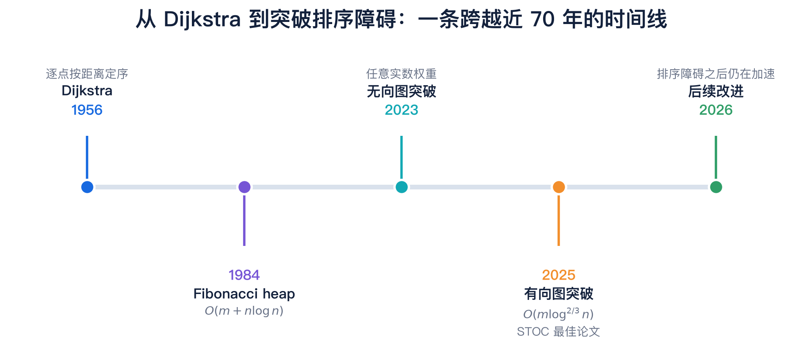
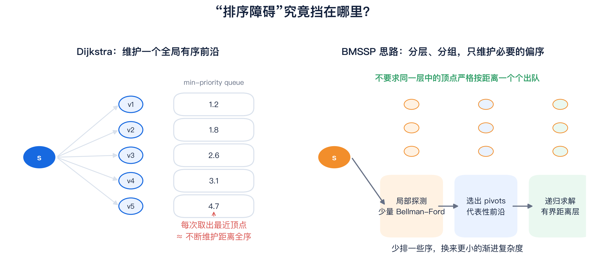
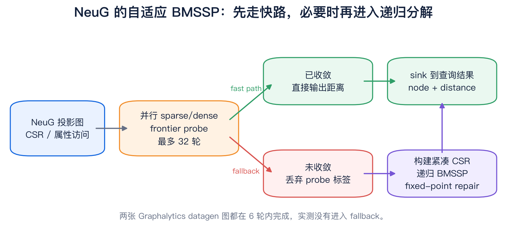
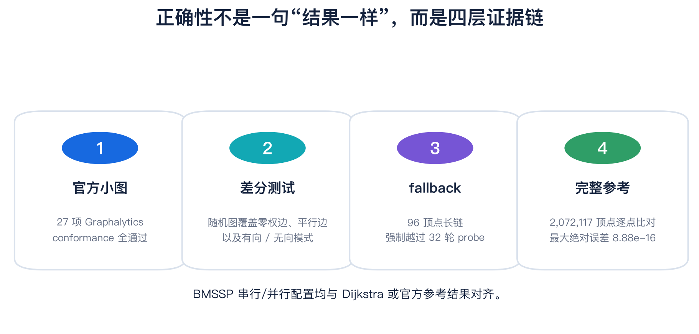
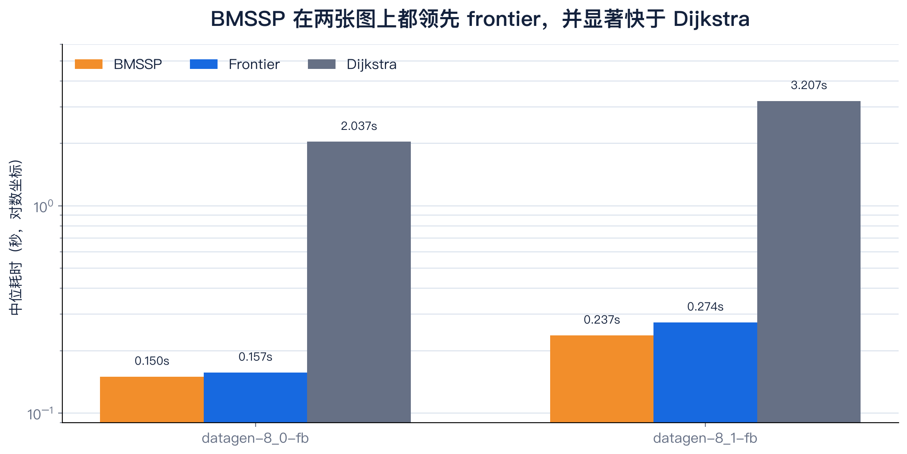
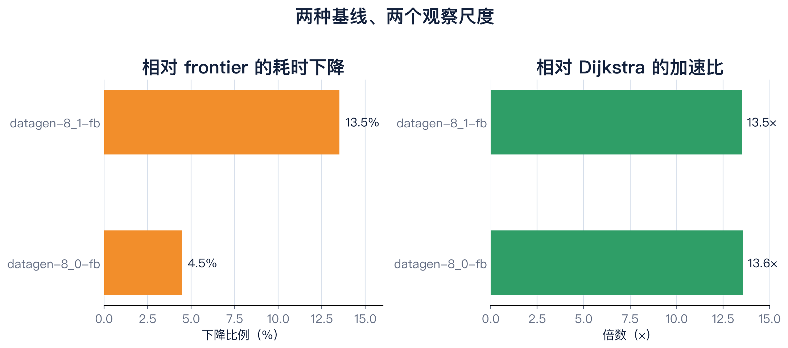
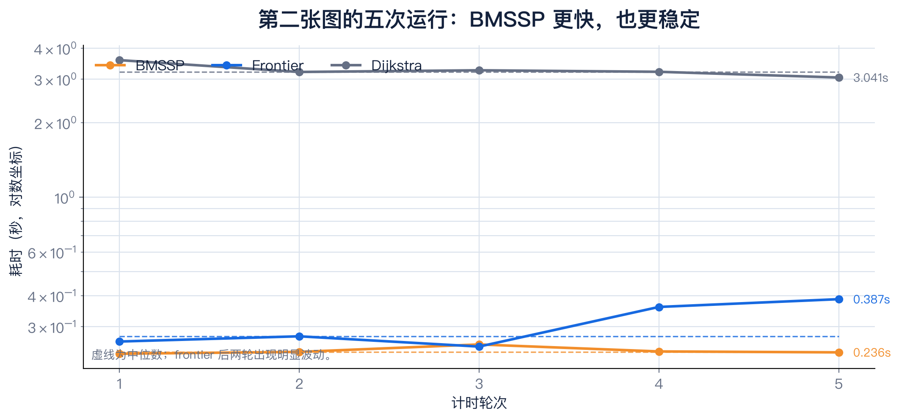

# 越过 Dijkstra 的排序高墙：我们把 STOC 2025 最佳论文 BMSSP 搬进了 NeuG

如果一段算法已经写进了几代人的教材，工业界用了近 70 年，并且最好的通用实现早在
上世纪 80 年代就触碰到了一个看似自然的复杂度边界，那么还能从哪里挤出速度？

2025 年，Ran Duan、Jiayi Mao、Xiao Mao、Xinkai Shu 和 Longhui Yin 给出了一个出人
意料的答案：**不要把所有顶点排好序。**

他们的论文
[《Breaking the Sorting Barrier for Directed Single-Source Shortest Paths》](https://arxiv.org/abs/2504.17033)
第一次在比较—加法模型、任意非负实数边权的有向图上，把单源最短路（SSSP）的时间
复杂度从 Dijkstra 的 $O(m+n\log n)$ 推进到确定性的
$O(m\log^{2/3}n)$。论文进入 [STOC 2025 正式论文集](https://doi.org/10.1145/3717823.3718179)，
并获得 [STOC 2025 Best Paper Award](https://www.sigact.sigact.hosting.acm.org/prizes/best_paper.html)。

这个结果不只在理论圈里引发讨论。清华大学把它称为“突破有向单源最短路径的排序
障碍”，[Quanta Magazine](https://www.quantamagazine.org/new-method-is-the-fastest-way-to-find-the-best-routes-20250806/)
则用一篇长篇报道讲述了这条跨越近 20 年、连接 Dijkstra、Bellman–Ford 和递归偏序的
研究路径，随后报道又被 [WIRED](https://www.wired.com/story/new-method-is-the-fastest-way-to-find-the-best-routes/)
转载。

但论文中的“渐进更快”，能否变成图数据库中的“墙钟时间更短”？这是另一道题。

我们在 NeuG GDS extension 中实现了一个实验性的自适应 BMSSP 后端，用 LDBC
Graphalytics 数据集验证正确性与性能。结果是：在两张千万到亿级存储边的图上，
BMSSP 相比 NeuG 原有 frontier SSSP 快 **4.5%–13.5%**，相比现有 Dijkstra 后端快
约 **13.5 倍**。

先别急着把这句话理解成“论文算法在任何图上都快 13 倍”。这篇文章会把理论突破、
工程取舍、数据结果，以及没有被结果掩盖的限制，一层层拆开。



> 图 1：Dijkstra 在 1956 年提出；1984 年的高级堆结构把通用比较模型下的经典界推进到
> $O(m+n\log n)$；2023 年先出现任意实数权重无向图上的突破，2025 年的工作进一步
> 覆盖有向图。2026 年已经出现继续改进该界的后续工作。

## 一堵由“顺序”砌成的墙

SSSP 的目标很朴素：给定源点 $s$，计算它到图中每个顶点的最短距离。导航、依赖分析、
网络路由、风控关系图和图数据库分析都会遇到它。

Dijkstra 的力量来自一个极其可靠的贪心顺序：

1. 把已经发现、但尚未最终确定的顶点放进最小优先队列；
2. 每次取出当前距离最小的顶点；
3. 松弛它的出边，再把新的候选距离放回队列。

这个过程不仅求出了距离，还顺手给所有顶点生成了按最短距离排列的全序。问题恰恰在
这里：**SSSP 只要求每个顶点的最终距离，并没有要求算法必须按距离顺序“盖章”。**

在比较模型中，维护这个全序会带来类似排序的 $n\log n$ 成本。2024 年 Robert Tarjan
等人的工作证明了 Dijkstra 对“distance ordering problem”具有普遍最优性；但正如
[清华大学对 STOC 2025 成果的说明](https://www.tsinghua.edu.cn/en/info/1245/14266.htm)
所强调的，这并不等于它对“不要求输出顺序的 SSSP”也最优。2025 年论文抓住的正是
二者之间的缝隙。



> 图 2：Dijkstra 不断从全局优先队列中取出最近顶点；新算法把前沿分层、分组，只维护
> 求解真正需要的偏序，不再逐点完成全局排序。

## 论文的关键：Bellman–Ford 不是慢，只是不能跑太久

新算法最反直觉的一点，是重新请回了另一个教科书算法：Bellman–Ford。

Bellman–Ford 不依赖距离排序，沿边反复传播松弛，因此对“边数很少的最短路径”很有效；
可一旦让它在整张图上跑到底，代价又太高。论文采取的是一种更精细的组合：

- 只运行少量 Bellman–Ford 步骤，向前“侦察”；
- 从被访问的区域中找出 pivots——可以覆盖大量后续最短路径树的代表性顶点；
- 把距离空间切成有界的层，不要求同一层中的顶点严格按距离依次完成；
- 递归求解这些 Bounded Multi-Source Shortest Path 子问题；
- 用支持批量插入与批量取出的数据结构控制每层前沿规模。

论文把核心递归过程称为 **BMSSP（Bounded Multi-Source Shortest Path）**。我们用
`bmssp` 作为 NeuG 后端名，而没有把算法叫作“Duan”：前者描述了算法结构，后者只是
作者姓氏，也无法覆盖五位作者的共同贡献。

当递归参数取 $k=\lfloor\log^{1/3}n\rfloor$、
$t=\lfloor\log^{2/3}n\rfloor$ 时，论文证明整体时间为
$O(m\log^{2/3}n)$。这不是把 heap 换得更花哨，而是减少了必须参与全局排序的对象。

Quanta 的报道用了一个很形象的说法：算法先找到类似“交通干道交叉口”的关键顶点，
从这些位置向前探索，再回来处理其余前沿。它不总是按距离从小到大访问每个顶点，
于是绕开了排序障碍。

## 从 17 页证明到一个图数据库算子

论文给出的是复杂度突破；数据库实现还要回答另外几件事：

- 图已经以 NeuG 的 CSR 和属性列存储，是否值得为每次查询再转换一次？
- 理论中的常数度图变换，会不会让工程内存占用和构图成本吞掉收益？
- 论文的数据结构更关注渐进界，现实中的 cache locality、原子更新和线程调度怎么办？
- 如果某张图并不适合递归 BMSSP，能否避免为理论结构支付固定成本？
- 无论走哪条路径，如何保证不会把“部分收敛”的标签交给用户？

我们的答案不是照着伪代码逐行翻译，而是做成一个**自适应后端**。



> 图 3：低直径图优先使用并行 sparse/dense frontier probe；超过 32 轮仍未收敛时，
> 丢弃 probe 标签，延迟构建紧凑 CSR，再进入递归 BMSSP 和 fixed-point repair。

具体来说：

1. **先跑有界 fast path。** 直接访问 NeuG 投影图，以活跃前沿密度在 sparse 和 dense
   扫描间切换，最多 32 轮，并使用 `concurrency` 指定的线程数。
2. **收敛就立即返回。** 对低直径图，不物化额外 CSR，也不进入递归结构。
3. **未收敛才构建 fallback。** probe 中间标签会被丢弃，避免将不完整状态带入后续
   证明边界；随后构建紧凑 CSR，执行 pivot、frontier 和 base-case 递归。
4. **最后做 fixed-point repair。** 扫描仍违反松弛条件的边，通过优先队列传播更新，
   直到不存在可改进距离。

这也是本文结果最需要读者注意的一点：**两张 Graphalytics datagen 图都在 6 轮 probe
内收敛，性能数字主要反映自适应 fast path，而不是递归 fallback 的吞吐。** BMSSP 的
价值在这里首先体现为一种策略框架：让容易的图走短路，让困难的图仍有一个正确的递归
后备路径。

## 接口没有变：仍然是 `sssp`

我们没有增加一个独立过程名。用户仍调用 `sssp`，只用较短的 `algo` 选择后端：

```cypher
CALL sssp('social', {
  source: '6',
  weight: 'weight',
  directed: false,
  concurrency: 8,
  algo: 'bmssp'
})
YIELD node, distance
RETURN node.id, distance;
```

`algo` 可取：

- `auto`：默认值；距离查询使用 frontier，需要谓词或 `path` 时使用 Dijkstra；
- `frontier`：NeuG 原有并行 frontier SSSP；
- `dijkstra`：带优先队列、支持谓词和路径输出的实现；
- `bmssp`：本文实验性自适应后端。

旧的 `implementation` 参数仅保留兼容，已经弃用；同时传入 `algo` 和
`implementation` 会直接报错。

## 先证明结果可信，再谈快了多少

最短路算法最危险的性能优化，是在某些边界条件下悄悄留下“看起来很合理”的错误距离。
因此我们没有只跑几个手工样例，而是建立了四层验证：



> 图 4：从官方小图、随机差分、强制 fallback，到两百多万顶点的完整参考输出，分别
> 覆盖接口一致性、边界条件、后备路径和规模化结果。

- Graphalytics conformance suite 共 27 项测试通过；SSSP 同时检查 `frontier`、
  `dijkstra`、`bmssp`。
- 固定随机种子的 64 顶点图覆盖有向/无向、多个 source、零权边和平行边，BMSSP 的
  单线程和 4 线程结果均与 Dijkstra 对齐。
- 一条 96 顶点长链强制 probe 超过 32 轮，确保真正执行 fallback；结果与 Dijkstra
  完全一致。
- `datagen-8_1-fb` 的 2,072,117 个顶点全部与官方 SSSP 参考输出逐点比较，最大绝对
  误差为 `8.88e-16`。

## 实测：领先 frontier 4.5%–13.5%，比现有 Dijkstra 快约 13.5 倍

测试机器为 Apple M4 Pro（12 核，48 GB），NeuG 使用 8 线程。每个算法先预热 1 次，
再计时 5 次并报告中位数。查询完整执行 kernel，但只返回一行计数，避免把数百万行
结果序列化到 Python；首次 `COPY FROM`、图投影和 checkpoint 不计入算法时间。

| 数据集 | 顶点数 | NeuG 存储边数 | 方向 | Source |
|---|---:|---:|---|---:|
| `datagen-8_0-fb` | 1,706,561 | 107,507,376 | 无向 | 6 |
| `datagen-8_1-fb` | 2,072,117 | 134,267,822 | 无向 | 6 |



> 图 5：纵轴使用对数坐标。BMSSP 在两张图上的中位耗时分别为 0.150 秒和 0.237 秒；
> Dijkstra 分别为 2.037 秒和 3.207 秒。

| 数据集 | BMSSP | Frontier | Dijkstra |
|---|---:|---:|---:|
| `datagen-8_0-fb` | **0.150 s** | 0.157 s | 2.037 s |
| `datagen-8_1-fb` | **0.237 s** | 0.274 s | 3.207 s |



> 图 6：相比已经很快的 frontier，BMSSP 进一步降低 4.5% 和 13.5% 的延迟；相比
> NeuG 当前 Dijkstra 后端，加速比分别为 13.6× 和 13.5×。

Dijkstra 的对比需要一个限定：三种查询传入相同的 `concurrency: 8`，但 NeuG 当前
Dijkstra 后端的核心优先队列路径并未像 frontier probe 一样并行化。因此这里的 13.5×
代表“相对 NeuG 当前可用 Dijkstra 后端”的工程收益，不应外推为对所有并行 Dijkstra
实现的普遍结论。

第二张图保留了完整的五次原始日志，也让我们看到中位数为什么比“挑一个最好看的
数字”更可信：



> 图 7：BMSSP 五次运行集中在 0.233–0.254 秒；frontier 后两轮升至 0.360 和
> 0.387 秒；Dijkstra 保持在 3 秒量级。虚线表示各自中位数。

## Profile 告诉我们的，不只是“哪里慢”

设置 `NEUG_BMSSP_PROFILE=1`，可以记录 probe 轮数与各阶段时间。在
`datagen-8_1-fb` 上，一次接近冷态的运行得到：

```text
BMSSP probe profile: init_ms=5.17579 rounds=6 concurrency=8 compute_ms=283.403
```

这次带日志运行的查询耗时约 0.311 秒，高于关闭额外 profiling 后的热态中位数
0.237 秒，因此它只用于定位阶段成本，没有混入性能表。

更重要的结论是：这两张图没有触发递归 fallback。下一轮优化不该只继续打磨 fast path，
而应补上能够真正考验论文结构的工作负载：高直径道路网、稀疏有向图、长链和前沿长期
保持稀疏的图。届时需要分别测量 CSR 构建、pivot 搜索、递归 frontier 和 repair 的成本。

## 这还不是论文复杂度的“工业复现证明”

我们愿意强调结果，也同样需要强调边界：

- 当前 `OrderedFrontier` 是“每个顶点保留一个最优 key”的正确性优先实现，不是论文
  Lemma 3.3 中完整的 block data structure；
- 没有执行论文的显式常数出度图变换，避免每次查询扩大图；
- fallback 目前为单线程，线程收益主要来自前置 probe；
- fixed-point repair 是工程安全网，但它改变了工作量分析；
- `bmssp` 当前只接受有限、非负权重，只支持无谓词投影图的距离输出；
- 两张性能图属于同一个 `datagen` 家族，不能代表所有图分布。

因此我们称它为 **experimental adaptive BMSSP backend**，而不宣称已经在 NeuG 中复现
论文的完整渐进界。

有意思的是，理论研究本身也没有停下。2026 年 2 月，Duan、Mao、Shu 和 Yin 又发布了
[后续算法](https://arxiv.org/abs/2602.07868)，进一步改进了 2025 年的界。这恰好验证了
Tarjan 在 Quanta 报道中的判断：越过排序障碍不是终点，而是把新的搜索空间打开了。

## 一条命令复现实验

两张图的原始 Graphalytics 文件、官方参考输出、SHA-256 清单和 ETL 脚本已经发布到
NeuG 的公开 OSS。脚本会自动下载、校验、解压，并创建 NeuG `COPY FROM` 使用的
`.csv` 别名：

```bash
python3 extension/gds/benchmark/fetch_graphalytics_data.py \
  --dataset all \
  --output ./graphalytics-data
```

然后执行三后端对比：

```bash
python3 extension/gds/benchmark/graphalytics_bench.py \
  --data-root ./graphalytics-data/datagen \
  --db-root ./neug-bench-db \
  --dataset datagen-8_1-fb \
  --concurrency 8 \
  --warmup-runs 1 \
  --runs 5 \
  --sssp-only \
  --sssp-algos bmssp,frontier,dijkstra
```

代码、报告和复现入口：

- [NeuG 实现分支](https://github.com/longbinlai/neug/tree/codex/bmssp-graphalytics-report)
- [技术报告与完整实验口径](BMSSP_TECHNICAL_REPORT.md)
- [原始结果 CSV](bmssp_results.csv)
- [公开数据与校验清单](https://neug.oss-cn-beijing.aliyuncs.com/datasets/ldbc-graphalytics/SHA256SUMS)

## 最后：理论突破与工程价值之间，需要一座桥

2025 年这篇论文最迷人的地方，不只是把指数里的 `1` 改成了 `2/3`。它提醒我们：一个
算法做了几十年的“必要步骤”，可能只是某种经典解法的副产品，而不是问题本身的要求。

Dijkstra 通过完整的顺序获得确定性；BMSSP 通过分层、pivot 和递归偏序，只购买真正
需要的顺序。NeuG 的实现又在这个思想之上加了一层工程自适应：短路能解决的图，不强迫
它进入复杂结构；真正困难的图，仍然保留正确的 fallback。

两张图、几百毫秒的结果不是终局，却足以说明一件事：**这项理论突破已经不只活在复杂度
公式里。它可以进入数据库接口，接受官方参考结果的检验，并在真实图数据上赢过已有实现。**

下一步，我们会把注意力放到更难的图上——因为一堵高墙被越过之后，最值得看的，永远是
墙后面还有多远。

## 参考资料

1. Ran Duan, Jiayi Mao, Xiao Mao, Xinkai Shu, Longhui Yin,
   [Breaking the Sorting Barrier for Directed Single-Source Shortest Paths](https://arxiv.org/abs/2504.17033), 2025.
2. [STOC 2025 proceedings version](https://doi.org/10.1145/3717823.3718179), pp. 36–44.
3. ACM SIGACT, [STOC Best Paper Award winners](https://www.sigact.sigact.hosting.acm.org/prizes/best_paper.html).
4. 清华大学，[段然团队获得 STOC 2025 最佳论文奖](https://www.tsinghua.edu.cn/info/1175/118821.htm)。
5. Ben Brubaker, [New Method Is the Fastest Way To Find the Best Routes](https://www.quantamagazine.org/new-method-is-the-fastest-way-to-find-the-best-routes-20250806/), Quanta Magazine, 2025-08-06.
6. Ran Duan, Xiao Mao, Xinkai Shu, Longhui Yin,
   [A Faster Directed Single-Source Shortest Path Algorithm](https://arxiv.org/abs/2602.07868), 2026.
